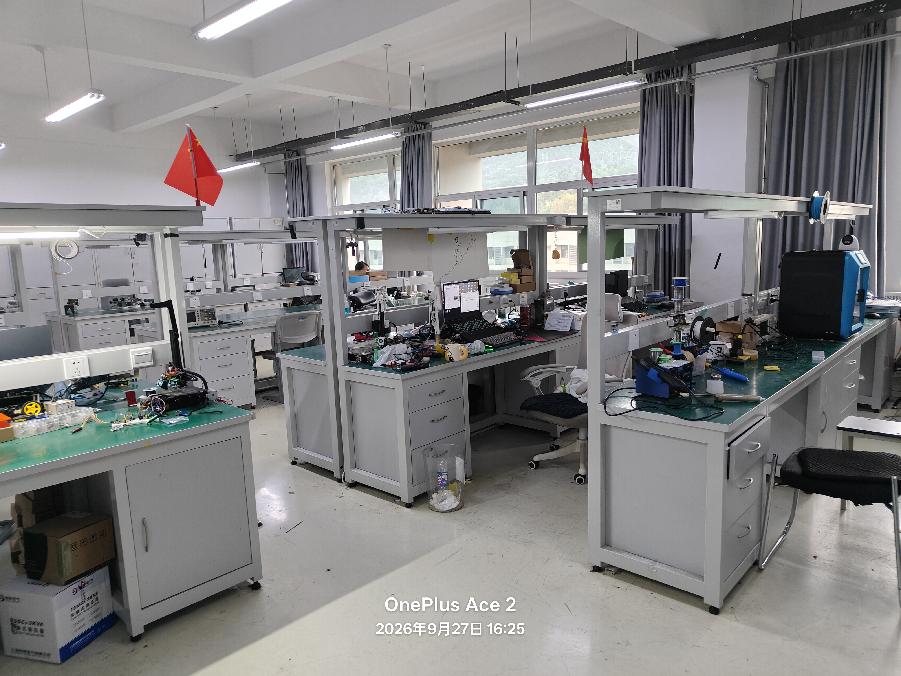
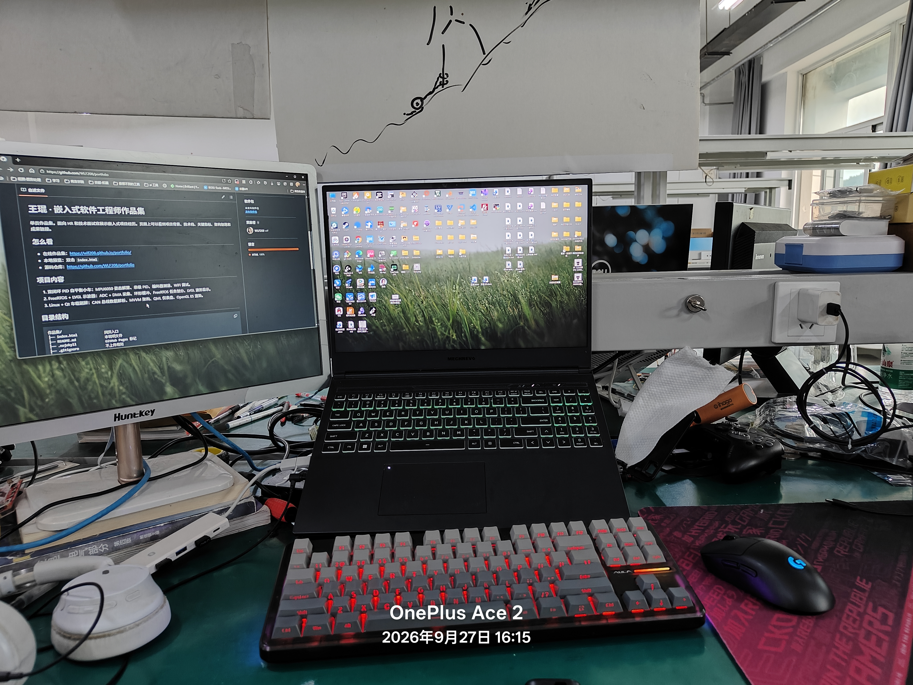
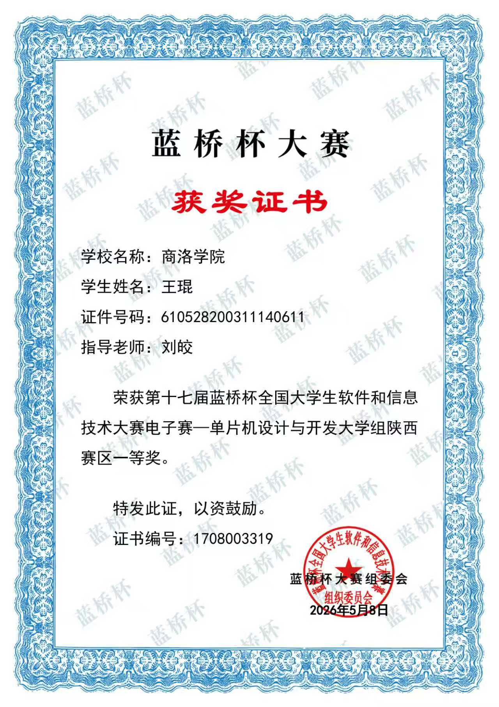
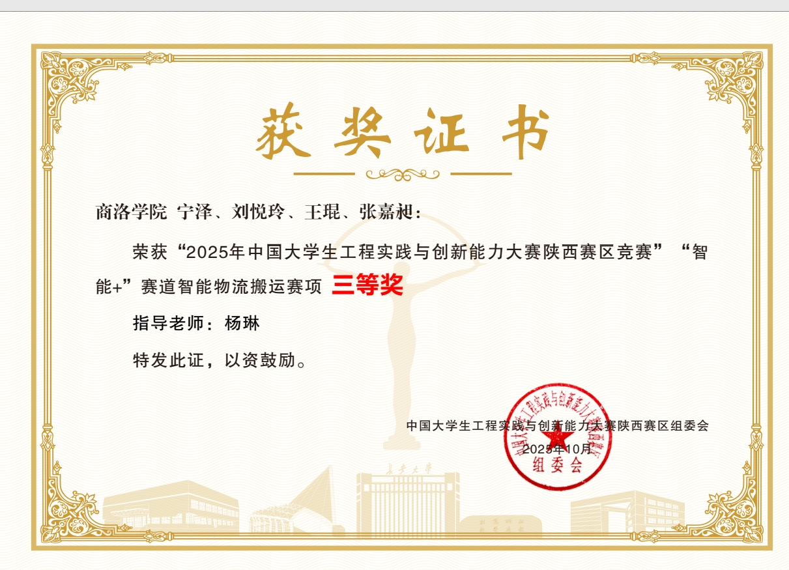
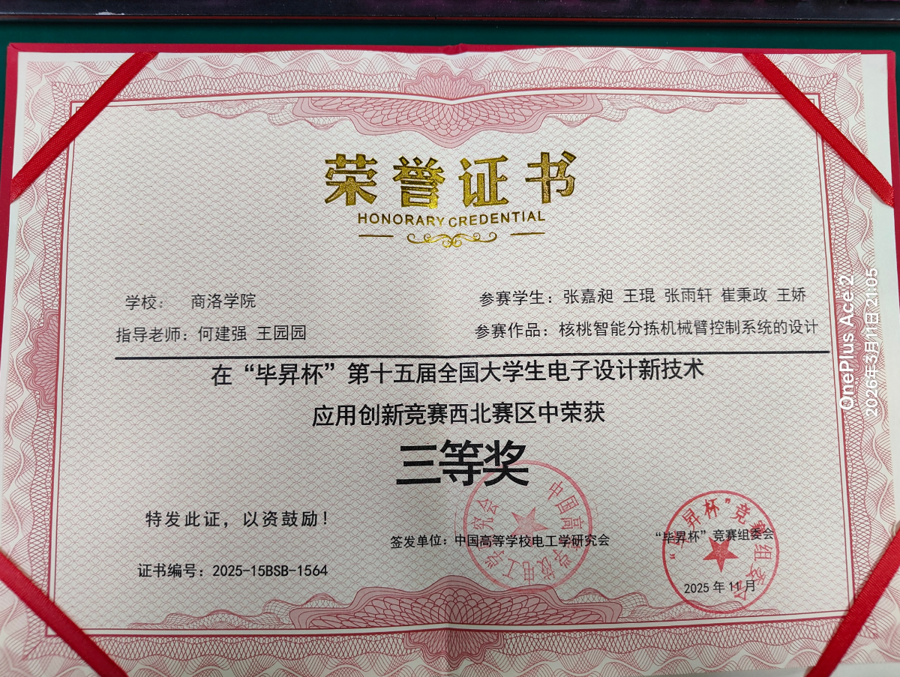
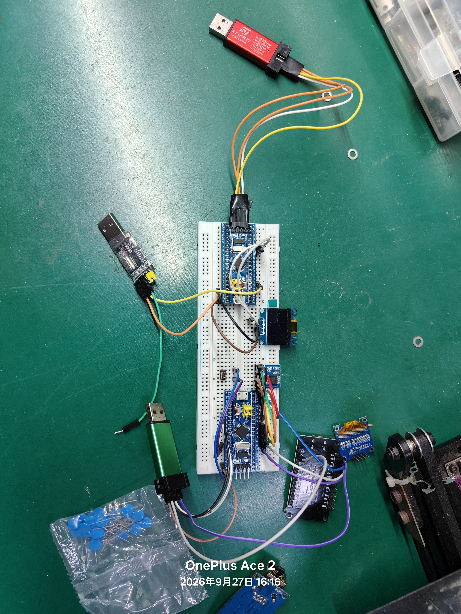
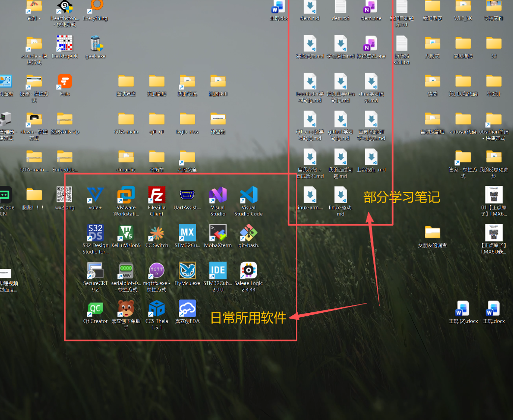
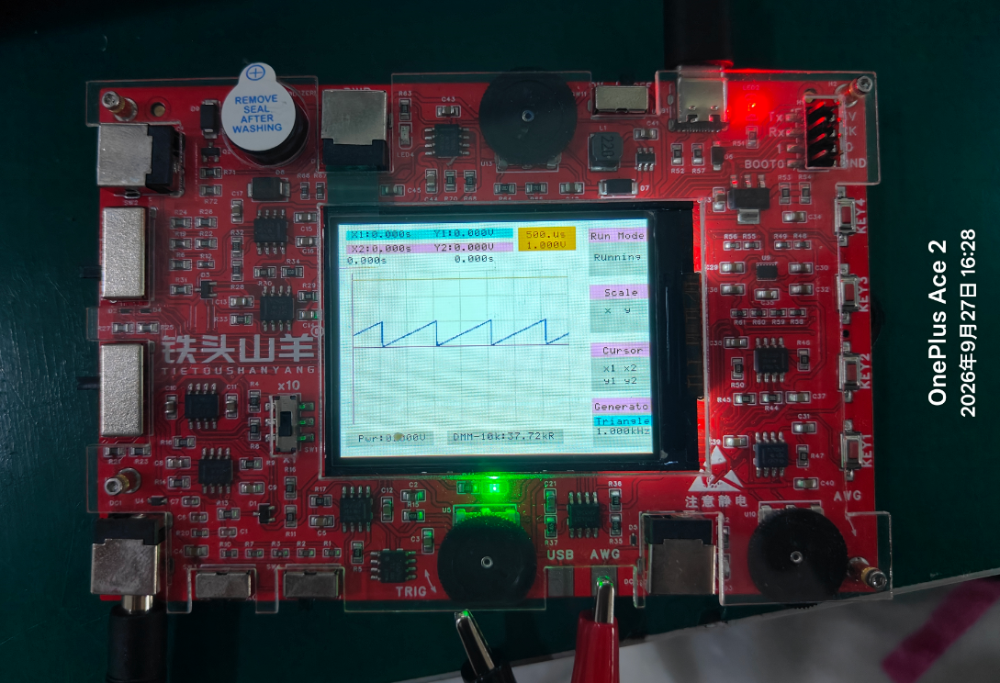

# 嵌入式软件工程师 · 作品集

> 嵌入式软件工程师，熟悉 MCU 开发与 RTOS，正在深入 Linux 嵌入式方向，目前在学习嵌入式 AI 视觉。

---

## 目录

- [关于我](#关于我)
- [竞赛与经历](#竞赛与经历)
- [技术栈总览](#技术栈总览)
- [技术能力详情](#技术能力详情)
- [风采展示](#风采展示)
- [联系我](#联系我)

---

## 关于我

- 嵌入式软件工程师方向，熟悉 MCU 逻辑开发与 FreeRTOS 实时系统开发
- 有全国大学生电子设计竞赛与实验室项目经历，获蓝桥杯省级一等奖
- 掌握 Linux 下的系统移植、驱动开发与应用开发基础能力
- 目前正在学习嵌入式 AI 视觉方向

## 竞赛与经历

| 经历 | 说明 |
| --- | --- |
| **电子设计竞赛（电赛）** | 参与竞赛全程，负责嵌入式程序设计与系统调试，完成硬件模块联调与整体功能实现 |
| **实验室经历** | 长期在实验室参与项目开发，积累硬件调试、代码编写、文档整理与团队协作经验 |
| **蓝桥杯** | 省级一等奖 |

## 技术栈总览

| 方向 | 技术内容 | 熟练度 |
| --- | --- | --- |
| MCU 逻辑开发 | STM32（标准库 / HAL）、Cortex-M0 系列 | 熟练 |
| RTOS 开发 | FreeRTOS | 熟悉 |
| Linux 系统 | 系统移植、驱动开发、应用开发 | 入门可用 |
| 嵌入式 AI 视觉 | 轻量模型部署、图像处理（学习中） | 学习中 |

## 技术能力详情

### 1. MCU 逻辑开发

熟悉 STM32、Cortex-M0 等系列 MCU 的常规开发，能够独立完成：

- GPIO、定时器、中断、DMA 等基础外设配置与使用
- UART、SPI、I2C、ADC、PWM 等常用外设通信与信号控制
- 基于标准库与 HAL 库的工程搭建与驱动编写
- 多模块系统的逻辑设计与整体调试

### 2. Linux 系统

Linux 方向目前处于入门到可用的阶段，具备嵌入式 Linux 开发的基础能力，覆盖驱动开发、系统移植与应用开发三大块：

- **(a) 系统移植**：能够完成基础的系统移植工作，包括交叉编译环境搭建、U-Boot 与 Linux 内核的编译移植、设备树配置、根文件系统构建（BusyBox / Buildroot）等
- **(b) 驱动开发**：了解 Linux 驱动模型，能够编写基础的字符设备驱动（模块加载、设备注册、file_operations 实现等）
- **(c) 应用开发**：能够在 Linux 环境下使用 C 语言进行应用开发，熟悉文件 I/O、进程 / 线程、Socket 网络编程等基础内容

> 说明：Linux 方向目前处于初级水平，能够满足日常开发使用，正在持续深入。

### 3. RTOS 开发（FreeRTOS）

熟悉 FreeRTOS 在 MCU 平台上的移植与开发，能够基于实时操作系统完成多任务系统设计：

- 任务的创建、调度与优先级管理
- 信号量、互斥锁、队列等任务间通信与同步机制
- 软件定时器与中断管理
- 基于 FreeRTOS 的嵌入式项目整体架构设计

### 4. 嵌入式 AI 视觉（学习中）

目前正在学习嵌入式方向的 AI 视觉技术，关注内容包括：

- 嵌入式端轻量化模型部署（如 TFLite Micro 等）
- 图像采集、预处理与基础图像处理
- 边缘端视觉应用的落地实践

## 风采展示

### 实验室日常

实验室项目开发与硬件调试照片。

### 蓝桥杯

蓝桥杯省级一等奖证书照片。

### MCU 开发（STM32 / M0）

STM32 开发板与调试过程照片。

### Linux 开发环境

Linux 板卡与开发环境照片（系统移植、驱动调试）。

### FreeRTOS 项目

基于 FreeRTOS 的多任务项目运行演示照片。

## 联系我

- QQ 邮箱：[2082331641@qq.com](mailto:2082331641@qq.com)
